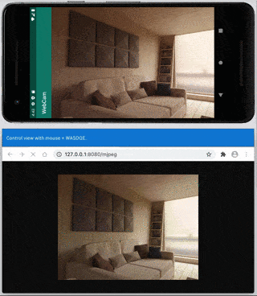

# WebCamAndroid

## What is this?

カメラ映像をMJPG/JPEGで配信するAndroidアプリです。

## Screenshot

## How to use

アプリ起動後に、`http://(Android端末のIPアドレス):8080`の以下のどちらかのパスにアクセスしてください。

* `/mjpeg`: MJPGフレーム
* `/current`: アクセス時点のJPEG
